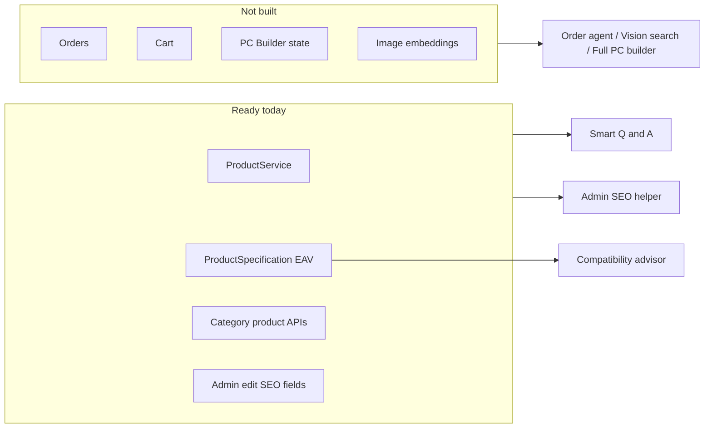
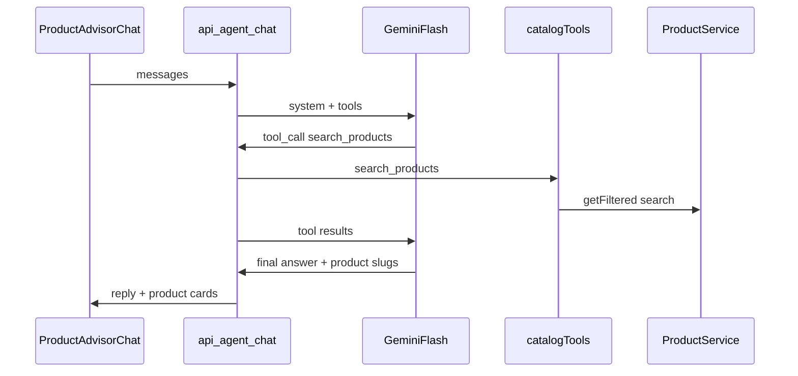

# AI/Agent Feature Roadmap — LogicBay BD

> **Status:** Saved for later — not implemented yet.  
> **Saved:** 2026-09-15  
> **How to resume:** Tell Cursor: “Implement the Smart Product Q&A plan in `docs/ai-agent-feature-roadmap.md`.”

---

## Overview

Evaluate six AI/agent candidates against LogicBay BD’s current catalog-only stack, pick **Smart Product Q&A** as the first 3–7 day build, and **Admin SEO helper** as the follow-up — with a concrete, low-cost Gemini Flash implementation plan.

---

## What this repo actually is

LogicBay BD is a **Next.js 15 + Prisma + PostgreSQL product catalog/CMS**, not a full commerce stack yet.

| Exists | Missing |
|--------|---------|
| Products, categories, brands, rich EAV specs | **Order / Cart / Checkout models** (`prisma/schema.prisma`) |
| Public APIs: `/api/products`, category routes, `/api/products/[slug]` | Real cart (Header badge is cosmetic `0`) |
| Admin CMS create/edit with `description` + SEO fields | Chat, FAQ pages, PC builder page |
| `ProductService.getFiltered` / `getBySlug` + `search` | Any LLM/embeddings code |
| ~**10 products** in latest backup | UploadThing unused; images are URL paste only |

---

## Feature scores (this codebase)

### 1) Smart product Q&A (search + recommend) — Easy (best first)

| Factor | Assessment |
|--------|------------|
| Complexity | Low–medium: one chat API + 2–3 tools + small widget |
| Required data | Names, prices, stock, specs, slugs — already in DB |
| API cost | Low: Gemini Flash; small catalog → few tokens/tools |
| Missing deps | LLM client + chat UI only |

**Why it fits:** `src/services/product.service.ts` already supports `search`, filters, and `getBySlug`. Category APIs under `src/app/api/products/` return specs suitable for grounded answers. No vector DB needed at ~10 SKUs.

### 2) Spec/compatibility advisor — Medium (second-tier later)

| Factor | Assessment |
|--------|------------|
| Complexity | Medium: normalize inconsistent keys (`socket_type` vs `cpu_socket` vs `socket`) + rule table |
| Required data | Specs exist per category libs (`*SpecDefinitions.ts`) |
| API cost | Low |
| Missing deps | Compatibility matrix + key normalization |

Feasible after Q&A; can reuse the same agent tools with a `check_compatibility` tool.

### 3) PC builder assistant — Hard

| Factor | Assessment |
|--------|------------|
| Complexity | High: builder UI, slot state, budget, compatibility, persistence |
| Required data | Specs partly there |
| API cost | Low–medium |
| Missing deps | Only a header stub in `Header.tsx`; no `/pc-builder` route |

Too large for a first 3–7 day ship.

### 4) Order status + FAQ support agent — Hard (order part blocked)

| Factor | Assessment |
|--------|------------|
| Complexity | Order path = new domain; FAQ-only = Easy but thin |
| Required data | No Order model / APIs |
| API cost | Low for FAQ |
| Missing deps | Entire order lifecycle; footer links (`/help`, `/contact`) have no pages |

Do not start here until checkout exists.

### 5) Admin catalog content helper (descriptions/SEO) — Easy (best second)

| Factor | Assessment |
|--------|------------|
| Complexity | Low: button on existing forms → fill fields |
| Required data | Product name + specs + price already loaded in edit |
| API cost | Very low (admin-only, few calls) |
| Missing deps | LLM call only; fields already in `ProductEditForm.tsx` |

High leverage after Q&A reuses the same `src/lib/ai` client.

### 6) Image → similar product search — Hard

| Factor | Assessment |
|--------|------------|
| Complexity | Vision + embeddings store + similarity search |
| Required data | Image URLs exist; no local binary pipeline |
| API cost | Higher (vision/embeddings) |
| Missing deps | UploadThing unused; no vector index; tiny catalog lowers ROI |

Defer until catalog is much larger.

---

## Recommendation

| Priority | Feature | Rationale |
|----------|---------|-----------|
| **Build first (3–7 days)** | **#1 Smart product Q&A** | Most agentic, uses existing catalog tools, visible on storefront, cheap model, no blocked domains |
| **Build second** | **#5 Admin SEO/description helper** | Same LLM stack; plugs into CMS you already use; tiny scope |
| Later | #2 Compatibility → then #3 PC builder | Need key normalization + builder UI |
| Not now | #4 Orders, #6 Image search | Missing order system / expensive infra |

**Model default:** Google **Gemini 2.0 Flash** (free tier / cheap). DeepSeek as optional alternate env. No rewrite of the store.

---

## Implementation plan — Feature #1 only (Smart Product Q&A)

### Implementation todos (when you start)

1. Add Gemini Flash client + env (`GEMINI_API_KEY`)
2. Implement `search_products` / `get_product` / `list_categories` tools on ProductService
3. `POST /api/agent/chat` with tool loop + rate limit
4. `ProductAdvisorChat` widget + mount in `StorefrontChrome`
5. Smoke-test grounded Q&A on live catalog products

### Architecture (keep small)

### Files to create

- `src/lib/ai/gemini.ts` — thin Gemini Flash client (`GEMINI_API_KEY`)
- `src/lib/ai/catalogTools.ts` — tools wrapping Prisma/`ProductService`:
  - `search_products({ query, category?, brand?, maxPrice?, limit? })`
  - `get_product({ slug })` — name, price, stock, key specs, URL
  - `list_categories()` — light taxonomy for routing questions
- `src/app/api/agent/chat/route.ts` — POST; tool loop (max 3 rounds); return `{ reply, products[] }`
- `src/components/agent/ProductAdvisorChat.tsx` — floating chat; links to `/products/[slug]`
- Wire widget once in `src/components/layout/StorefrontChrome.tsx` (or layout)

### Files to change lightly

- `.env.example` — `GEMINI_API_KEY=`, optional `AI_MODEL=gemini-2.0-flash`
- No Prisma migration; no new tables for v1

### Prompt / safety (minimal)

- System prompt: answer **only** from tool results; if no match, say so; prefer in-stock; prices in BDT; never invent SKUs
- Cap `limit` ≤ 5 products per search
- Simple IP rate limit in the route (in-memory Map is fine for localhost/small traffic)

### Explicit non-goals for v1

- No vector DB / embeddings
- No order tracking
- No PC builder slots
- No streaming required (optional later)
- No auth gate for public Q&A (admin tools stay separate)

### Acceptance criteria (3–7 days)

1. User asks “budget Ryzen 5 under 20000” → tools search → reply cites real products with links
2. User asks for a known slug/name → `get_product` returns specs/warranty/price correctly
3. Hallucinated products do not appear when catalog has no match
4. Works with Gemini Flash free/cheap key; site still works if key missing (chat shows config message)

### Gaps to accept

- Catalog is small (~10 SKUs) — quality depends on filling CMS
- Spec key inconsistency does **not** block Q&A; it only matters for a later compatibility tool
- Header search stub remains separate; Q&A does not require wiring it first
